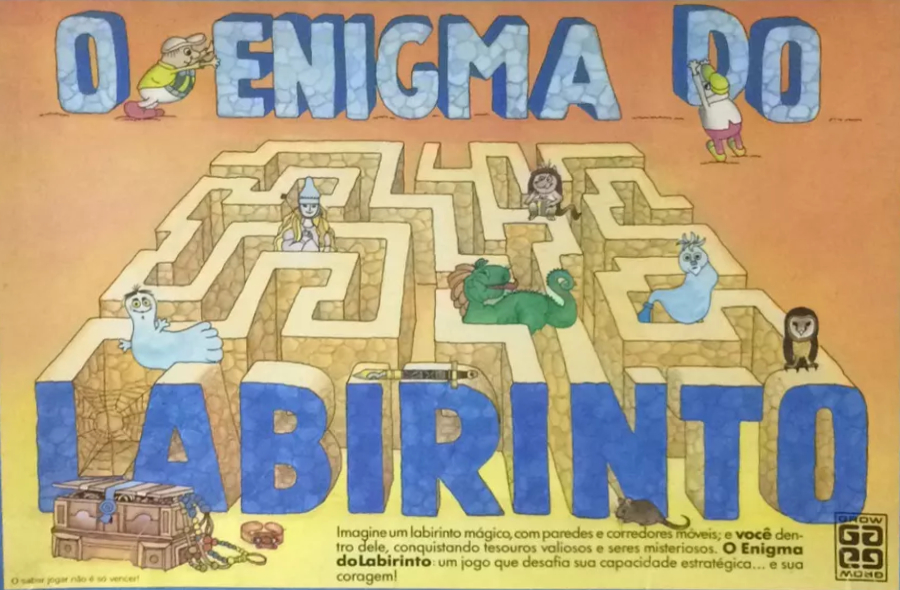

# O ENIGMA DO LABIRINTO

## Objetivo do Jogo:
Os jogadores vão fazer uma busca num labirinto encantado e cada um deles tem uma tarefa a cumprir, procurando objetos e criaturas misteriosas nos corredores do labirinto. Para que isto seja feito, os jogadores precisam manipular os corredores com muita esperteza.
O primeiro jogador a encontrar todos os elementos de sua busca e voltar ao seu ponto de partida será o vencedor do
Jogo.
